# Лабораторная работа №1

Картинки семейного древа:

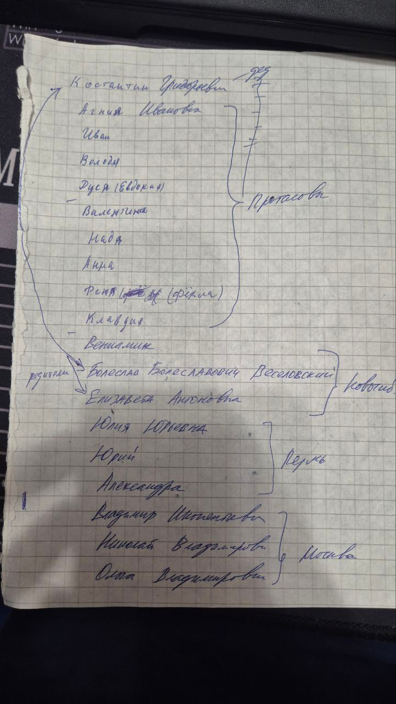
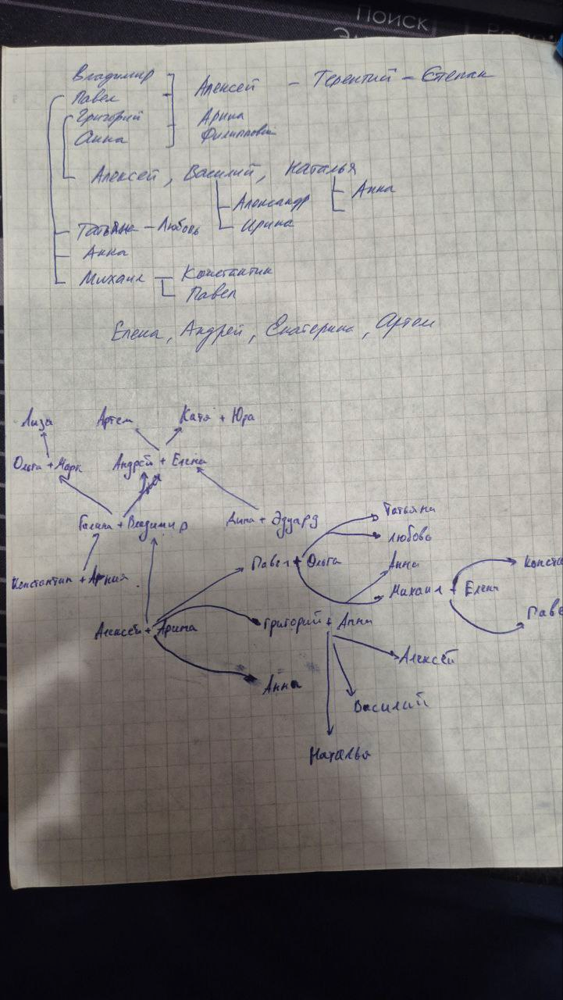

### Составлена база знаний на основе этого древа

Используются следующие факты:
- gender(имя + _ + первая буква отчества, пол, год рождения, год смерти (если человек жив, то 0))
- marriage(имя супруги, имя супруга, год создания брака, год распада брака (если брак не распался, то 0))
- parent(родитель, ребенок, год когда человек стал родителем)

### Примеры запросов
1) `alive(Person, 2000).` кто был жив в 2000 году.

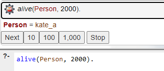

2) `parent(Parent, liza_m, 2012).` родители liza_m.

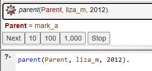

3) `sibling(X, kate_a).` братья и сёстры kate_a.

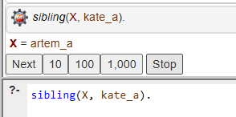

4) `grandparent(GP, artem_a).` дедушки и бабушки artem_a.

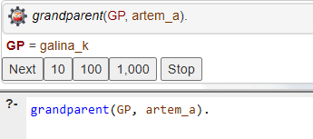

5) `ex_spouse(Person1, Person2).` пары бывших супругов.

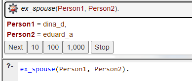

6) `married_in_year(Person, Spouse, 1990).` кто был женат в 1990 году.

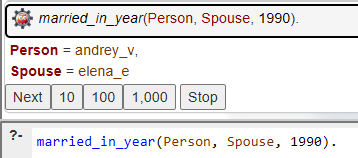

7) `grandparent(GP, GC), alive(GP, 1990).` дедушки/бабушки, жившие в 1990 году.

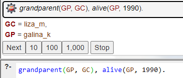

8) `child(Child, Person, 2005).` дети данного человека в 2005 году.

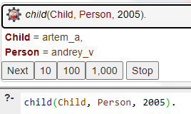

9) `married_longer_than(kate_a, urii_v, 3).` проверка, длился ли брак kate_a и urii_v более 3 лет.

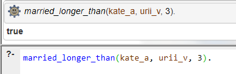

10) `child(artem_a, andrey_v, Year)` в каком году andrey_v был родителем artem_a

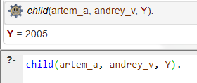

11) `alive(Person, 2025), gender(Person, _, Birth, _), Age is 2025 - Birth, Age > 50.` живые в 2025 году люди старше 50 лет.
12) `gender(Who, male, Birth, _), Birth < 1950.` мужчины, рождённые до 1950 года.
13) `gender(Person, _, 1942, _)` кто родился в 1942 году.
14) `marriage(Husband, Wife, 1991, _).` браки, заключённые в 1991 году.
15) `marriage(kate_a, Spouse, Year, _).` брак Кати А. (с кем и когда).
16) `ex_spouse(X, Y).` все бывшие супруги (аналогично запросу №5).
17) `married_in_year(Person1, Person2, 1975).` кто был женат в 1975 году.
18) `parent(mark_a, Child, _).` дети Марка А.
19) `child(kate_a, Parent, _).` родители Кати А.
20) `sibling(liza_m, Who).` братья и сёстры Лизы М.
21) `sibling(X, Y), gender(X, female, _, _).` все сестры (женщины, являющиеся сиблингами).
22) `grandparent(GP, kate_a).` дедушки/бабушки Кати А.
23) `alive(Person, 1950), gender(Person, female, _, _).` женщины, жившие в 1950 году.
24) `uncle_aunt(UncleAunt, liza_m,).` дяди и тёти Лизы М.
25) `married_longer_than(X, Y, 30).` пары, чей брак длился дольше 30 лет.
26) `uncle_aunt(Uncle, kate_a), gender(Uncle, male, _, _), alive(Uncle, 2025).` живые дяди Кати А. (мужчины) в 2025 году.
27) `grandparent(GP, artem_a), gender(GP, female, _, _), alive(GP, 1990).` бабушки Артёма А., которые были живы в 1990 году.
28) `child(Child, andrey_v, _), grandparent(GP, Child), alive(GP, 2000).` дети Андрея В., у которых в 2000 году была жива бабушка или дедушка.
29) `sibling(Sib, olga_v), gender(Sib, _, Birth, _), Birth < 1970.` братья/сёстры Ольги В., рождённые до 1970 года.
30) `married_longer_than(P1, P2, 20), alive(P1, 2010), alive(P2, 2010).` пары, чей брак длился больше 20 лет, и оба были живы в 2010 году.
